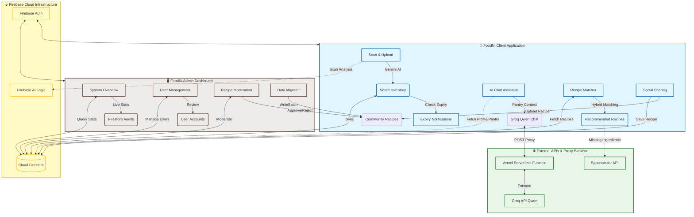

# 🥦 MAP: FoodNi Zero-Waste Ecosystem

Welcome to the **MAP (Mobile Application Development)** repository. This repository hosts **FoodNi**, a comprehensive, AI-powered ecosystem designed to minimize food waste and optimize kitchen management. 

The project contains two primary applications built with Flutter:
1. [food_ni](file:///c:/Users/user/OneDrive/Desktop/MAP/food_ni): The consumer-facing mobile application powered by Gemini AI and Spoonacular.
2. [foodni_admin](file:///c:/Users/user/OneDrive/Desktop/MAP/foodni_admin): The administrative dashboard for ecosystem monitoring, user auditing, and community recipe moderation.

---

## 🔮 Ecosystem Architecture

The diagram below details the integration flow between the mobile application, admin panel, Firebase, and external services:



---

## 📂 Repository Structure

```text
MAP/
├── food_ni/           # 📱 Main Flutter Consumer App
│   ├── android/       # Android configurations & Google Services
│   ├── functions/     # Firebase Cloud Functions (Background OCR processing)
│   ├── lib/           # Flutter application source code
│   │   ├── assistant/ # Personalized Qwen-based Chat Assistant
│   │   ├── camera/    # Local image management & Gemini vision scanner
│   │   ├── inventory/ # Pantry dashboards, details, calendar views
│   │   ├── recipes/   # Recipe matching screens & engines
│   │   └── social/    # Community sharing & custom recipe uploaders
│   └── .env           # Environment credentials (Spoonacular keys)
│
├── foodni_admin/      # 🖥️ Flutter Admin Dashboard
│   ├── lib/           # Dashboard source code
│   │   ├── core/      # Authentication & administrative services
│   │   └── features/  # Feature pages (Audits, Dashboard, Moderation Queue)
│   └── web/           # Web-specific deployment configurations
│
└── README.md          # 📖 Root Documentation (This file)
```

---

## 📱 1. FoodNi Client App (`food_ni`)

FoodNi is an intelligent pantry companion designed to eliminate food waste. It features automated status indicators, custom reminders, and recipes calculated based on expiry dates.

### ✨ Key Features

*   **📸 AI Food Scanning:** Snaps a grocery image and analyzes it using the [CameraService](file:///c:/Users/user/OneDrive/Desktop/MAP/food_ni/lib/camera/camera_service.dart). Under the hood, it communicates with `gemini-3.5-flash` via the Firebase AI SDK to identify the product, estimate shelf life, generate storage instructions, and provide nutritional values.
*   **📦 Smart Inventory & Interactive Calendar:** Visualizes the kitchen via a color-coded shelf-life dashboard (Expired, Expiring Soon, Fresh). The [CalendarScreen](file:///c:/Users/user/OneDrive/Desktop/MAP/food_ni/lib/inventory/calendar_screen.dart) displays expiration dates in an interactive layout for proactive meal planning.
*   **🍳 Hybrid Recipe Engine:** Implements a fallback strategy in the [RecipeService](file:///c:/Users/user/OneDrive/Desktop/MAP/food_ni/lib/services/recipes/recipe_service.dart). It queries community-submitted recipes on Firestore (`FirebaseRecipeService`) and queries the Spoonacular API (`ExternalRecipeService`) concurrently if matching recipes are scarce.
    *   **Ranking Algorithm:** Recipes are sorted based on:
        $$\text{Score} = (\text{Ingredient Match \%} \times 0.7) + (\text{Waste Reduction Score} \times 0.3)$$
    *   The **Waste Reduction Score** prioritizing recipes using ingredients nearest to expiration, computed dynamically via the [ExpiryPriorityService](file:///c:/Users/user/OneDrive/Desktop/MAP/food_ni/lib/services/recipes/expiry_priority_service.dart).
*   **💬 Personalized Chat Assistant:** Powered by the [AssistantScreen](file:///c:/Users/user/OneDrive/Desktop/MAP/food_ni/lib/assistant/assistant_screen.dart). Unlike standard chatbots, it compiles the user's sorted pantry list directly into a system prompt. It forwards queries to a Groq-hosted Qwen model proxied through the [AssistantChatService](file:///c:/Users/user/OneDrive/Desktop/MAP/food_ni/lib/assistant/assistant_chat_service.dart) to deliver personalized, zero-waste tips.
*   **🔔 Smart Notifications System:** Handled by the [ExpiryNotificationService](file:///c:/Users/user/OneDrive/Desktop/MAP/food_ni/lib/notifications/expiry_notification_service.dart). It schedules local notifications 1 day prior to expiry and runs a daily local check to notify users about expiring items (shelf life $\le 3$ days), compiling matching recipes directly into the notification text.
*   **🌐 Community Sharing:** Allows users to publish customized dishes to the community feed via the [UploadRecipeScreen](file:///c:/Users/user/OneDrive/Desktop/MAP/food_ni/lib/social/upload_recipe_screen.dart).
*   **📚 Storage Guidelines:** An interactive reference library in [StorageGuideScreen](file:///c:/Users/user/OneDrive/Desktop/MAP/food_ni/lib/storage/storage_guide_screen.dart) categorizing optimal temperature and handling conditions for grocery categories.

---

## 🖥️ 2. FoodNi Admin Dashboard (`foodni_admin`)

FoodNi Admin is a control center designed for administrative operations, platform oversight, and catalog health.

### ✨ Key Features

*   **📊 Live System Overview:** Features real-time counters tracking active users, total inventory items, system-wide recipe entries, and AI transaction metrics in [DashboardPage](file:///c:/Users/user/OneDrive/Desktop/MAP/foodni_admin/lib/features/dashboard/dashboard_page.dart).
*   **👥 User Auditing:** Interactive records in [UserManagementPage](file:///c:/Users/user/OneDrive/Desktop/MAP/foodni_admin/lib/features/users/user_management_page.dart) allowing administrators to audit profile details, activity logs, and status information.
*   **📦 Food Inventory Inspector:** The [FoodItemsPage](file:///c:/Users/user/OneDrive/Desktop/MAP/foodni_admin/lib/features/food_items/food_items_page.dart) gives admin-level read-only access to all registered food items across individual user accounts for analytics and safety supervision.
*   **🍳 Community Recipe Moderation Queue:** The [RecipeReviewView](file:///c:/Users/user/OneDrive/Desktop/MAP/foodni_admin/lib/features/recipes/recipe_review_page.dart) handles community-submitted content:
    *   **Pending Tab:** Displays new submissions requiring review before they are made public.
    *   **Approved Tab:** Displays published recipes.
    *   **Rejected Tab:** Displays rejected recipes, featuring logs containing rejection notes.
    *   **All Tab:** Combines community recipes with immutable, pre-populated "seeded" recipes.
*   **⚙️ Database Migration Service:** Uses [RecipeMigrationService](file:///c:/Users/user/OneDrive/Desktop/MAP/foodni_admin/lib/core/services/recipe_migration_service.dart) to automatically parse older recipe structures. It applies batch updates (throttled to 500 documents per write-batch) to set default status keys to `'pending'`.

---

## ⚙️ 3. Cloud Functions Backend (`functions`)

Located inside [food_ni/functions](file:///c:/Users/user/OneDrive/Desktop/MAP/food_ni/functions), this directory handles intensive background image tasks.

*   **`processFoodImage` Cloud Function:** Triggered on document creation in the `image_processing_queue/{docId}` path. It fetches images directly from Firebase Storage, runs OCR and identification via the `@google/generative-ai` SDK (`gemini-1.5-flash`), parses JSON payloads, and updates documents in Firestore with OCR-recovered expiry dates, names, and storage tips.

---

## 🚀 Setup & Installation

### 📋 Prerequisites

*   **Flutter SDK** (Dart Version `3.11.x` recommended)
*   **Android SDK / Android Studio** (or VS Code with Dart & Flutter extensions)
*   **Firebase Account** with an active Firestore Database and Firebase Authentication (specifically Google Sign-in) configured.

### 🔑 Configuration

1.  **Firebase Settings:**
    *   Download your registered `google-services.json` from the Firebase Console.
    *   Place it in the target directory: [food_ni/android/app/google-services.json](file:///c:/Users/user/OneDrive/Desktop/MAP/food_ni/android/app/google-services.json)
2.  **Environment Variables:**
    *   Locate the environmental configuration file at [food_ni/.env](file:///c:/Users/user/OneDrive/Desktop/MAP/food_ni/.env)
    *   Input your Spoonacular API key:
        ```env
        SPOONACULAR_API_KEY=your_spoonacular_key_here
        ```

### 💻 Running the Applications

#### Running the Client App (`food_ni`)
```bash
cd food_ni
flutter pub get
flutter run
```
> [!NOTE]
> Windows developers can run `./run.ps1` in the `food_ni` directory to automatically restart the ADB server and boot the application.

#### Running the Admin App (`foodni_admin`)
```bash
cd foodni_admin
flutter pub get
flutter run -d chrome
```

---
*Developed as part of the Mobile Application Development (MAP) module.*